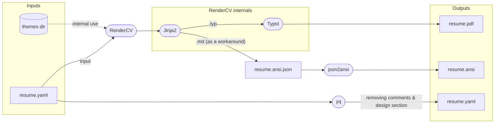

# resume-pipeline

This repository provides a reproducible pipeline for building resumes using [RenderCV](https://github.com/rendercv/rendercv) and Nix.

It converts [RenderCV YAML resumes](https://github.com/rendercv/rendercv/blob/main/schema.json) into multiple output formats (PDF, ANSI, cleaned YAML) using customizable themes and templates. The pipeline can be run locally via Nix or automated through the included GitHub Actions workflow for deployment to GitHub Pages.

## Pipeline Overview



## Usage

To build your resume, run:

```sh
nix run github:zyasserd/resume-pipeline <input_yaml> [output_basename]
```

### Example

```sh
# Basic usage (creates resume.pdf, resume.ansi, resume.yaml)
nix run github:zyasserd/resume-pipeline my-resume.yaml

# Custom output name (creates john-doe.pdf, john-doe.ansi, john-doe.yaml)  
nix run github:zyasserd/resume-pipeline my-resume.yaml john-doe
```

## Output

After running the pipeline, an `result` directory will be created in your working directory. This folder will contain:

- `<output_basename>.pdf` (PDF version)
- `<output_basename>.ansi` (ANSI text)
- `<output_basename>.yaml` (Cleaned YAML)

In addition, it will also contain:
- `flattened_pdf_lost_links.html`
    - containing the lost information in case the PDF is flattened and the links are removed
- `index.html`
    - a directory listing

You can customize themes and templates by editing files in the `themes/` directory.


## GitHub Actions Integration

This repository includes a reusable GitHub Actions workflow that automatically builds and deploys your resume to GitHub Pages. This is perfect for maintaining an always up-to-date online version of your resume.

### Using the Workflow

Create a `.github/workflows/resume.yaml` file in your repository:

```yaml
name: Build Resume

on:
  push:
    branches: [main]

  # Allows you to run this workflow manually from the Actions tab
  workflow_dispatch:

# Sets permissions of the GITHUB_TOKEN to allow deployment to GitHub Pages
permissions:
  contents: read
  pages: write
  id-token: write
  actions: write

jobs:
  build:
    uses: zyasserd/resume-pipeline/.github/workflows/main.yaml@main
    with:
      yaml_path: 'path/to/your/resume.yaml'
      output_basename: 'resume'  # optional, defaults to 'resume'
      setup_github_pages: true   # optional, defaults to true
      save_artifact: true        # optional, defaults to true
```

### Workflow Features

- **Automatic building**: Triggered on pushes to main branch or manual dispatch
- **GitHub Pages deployment**: Automatically deploys your resume as a website
- **Artifact storage**: Saves build outputs for download
- **Configurable**: Customize output names and deployment settings


## ANSI Output Width

You can control the width of the ANSI-formatted resume output by setting the following field in your YAML file:

```yaml
design:
  ansi:
    width: 80  # Set your desired terminal width (default: 80)
```

If `design.ansi.width` is not specified, the pipeline uses a default width of **80** characters.  
This value determines how wide the resume appears in the terminal or ANSI-compatible viewers.


<br>
<br>
<br>

## Schema Alternatives

This pipeline uses RenderCV's format. Here's how it compares to alternatives:

#### jsonresume.org
- **[Schema](https://github.com/jsonresume/resume-schema/blob/master/schema.json)**
- **Pros:** Well-structured schema, strong community, good HTML themes, GitHub CI integration
- **Cons:** More restrictive (e.g., limited publications support), no LaTeX support
- **Tools:** resume-cli (unmaintained), resumed

#### RenderCV  
- **[Schema](https://github.com/rendercv/rendercv/blob/main/schema.json)**
- **Why chosen:** More flexible format, better suited for diverse resume layouts

### Format Conversion
- **JSON Resume → RenderCV:** [@jsonresume/jsonresume-to-rendercv](https://www.npmjs.com/package/@jsonresume/jsonresume-to-rendercv)
- **RenderCV → JSON Resume:** isn't that easy
